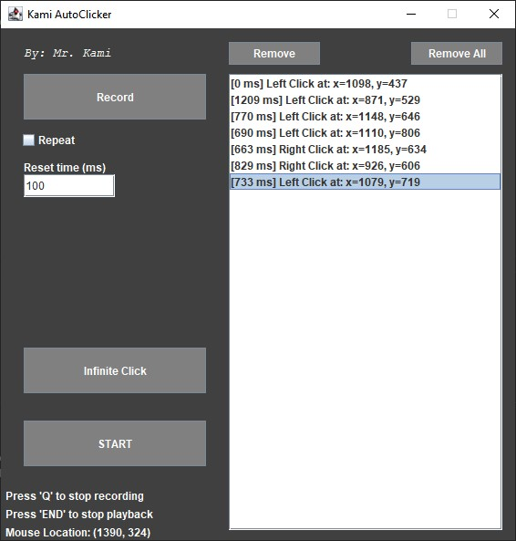

# Java-AutoClicker
Records and replays the users mouse click at the specified mouse coordinates

## Usage
1. Press **Record** and start clicking in the desired locations
2. Press **Q** key to stop recording
3. Press **START** to begin replaying the recorded clicks
4. If **Repeat** is checked, the recorded clicks will keep replaying until **END** key is pressed to stop the playback
5. Enter an amount of time in milliseconds in **Reset Time** to add a delay before the next **Repeat** cycle
6. If only constant spam clicks are desired, press **Infinite Click**

